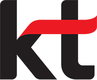

### Hello, I'm Backend Developer 👋

## Career
 롯데정보통신 (2021.10 ~ )  
 KTDS (2021.01 ~ 2021.10)  
 슈퍼루키 (2018.04 ~ 2019.02)  
 
## Programming Skills

<!--
**twoah/twoah** is a ✨ _special_ ✨ repository because its `README.md` (this file) appears on your GitHub profile.

Here are some ideas to get you started:

- 🔭 I’m currently working on ...
- 🌱 I’m currently learning ...
- 👯 I’m looking to collaborate on ...
- 🤔 I’m looking for help with ...
- 💬 Ask me about ...
- 📫 How to reach me: ...
- 😄 Pronouns: ...
- ⚡ Fun fact: ...
-->
